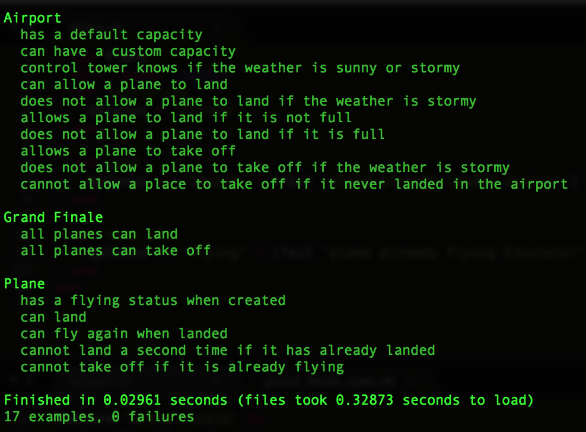

[](https://travis-ci.org/GBouffard/Airport-challenge) [](https://coveralls.io/r/GBouffard/Airport-challenge?branch=master)[](https://codeclimate.com/repos/55a3d554e30ba0481b001fa7/feed)

:airplane: Airport-Challenge :airplane:
===========
This is the Airport Challenge from Makers Academy: We have a request from a client to write the software to control the flow of planes at an airport. The planes can land and take off provided that the weather is sunny. Occasionally it may be stormy, in which case no planes can land or take off. Here are the user stories that we worked out in collaboration with the client.

```
As a pilot
So that I can arrive at my specified destination
I would like to land my plane at the appropriate airport

As a pilot
So that I can set off for my specified destination
I would like to be able to take off from the appropriate airport

As an air traffic controller
So that I can avoid collisions
I want to be able to prevent airplanes landing when the airport if full

As an air traffic controller
So that I can avoid accidents
I want to be able to prevent airplanes landing when the weather is stormy
```
The task was to test drive the creation a set of classes/modules to satisfy all the above user stories. Every plane must have a status indicating whether it's flying or landed.

Objectives of exercise
----
To learn about Object-Oriented-Programming and Test-Driven-Development.

Technologies used
----
- Ruby
- Rspec & Capybara
- Git

How to run it
----
```
git clone git@github.com:GBouffard/airport-challenge.git
cd airport-challenge
bundle install
irb
Dir["./lib/*"].each {|file| require file }
```
- You can now play around in IRB: planes can land and take off and the airport great them depending on the weather. You can even 'cheat' and control the weather (I so wish I could do that for real!) or leave it to randomize itself.

How to run tests
----
```
cd airport-challenge
rspec
```
and this is what you should see
